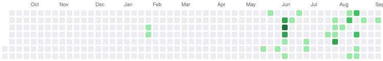

<!--
  This file is generated by scripts/generate-profile.mjs.
  Edit the generator, not README.md. The scheduled workflow only commits when data changes.
  Optional: create a WHATS_NEW.md and its contents are inlined as a "Now" section.
-->

<div align="center">

  <h1>Metehan Kaygısız</h1>


  <p>
    <a href="https://github.com/metehankaygsz?tab=followers"></a>
    <a href="https://github.com/metehankaygsz?tab=repositories"></a>
    
    
  </p>
</div>

## Featured Projects

<table>
    <tr>
      <td width="50%" valign="top">
        <a href="https://github.com/metehankaygsz/dashline"><strong>dashline</strong></a><br />
        A minimal Android launcher for car head units — clock, weather, media controls and app shortcuts. Works down to Android 4.4, no Google Play Services required.<br />
        <sub>Kotlin · ★ 14 · ⑂ 1</sub>
      </td>
      <td width="50%" valign="top">
        <a href="https://github.com/metehankaygsz/bcm94360cd-linux"><strong>bcm94360cd-linux</strong></a><br />
        Offline Broadcom BCM94360CD and BCM4360 Wi-Fi driver installer for Ubuntu Linux<br />
        <sub>Shell · ★ 4 · ⑂ 0</sub>
      </td>
    </tr>
    <tr>
      <td width="50%" valign="top">
        <a href="https://github.com/metehankaygsz/lan-play-arm"><strong>lan-play-arm</strong></a><br />
        Switch &quot;lan-play&quot; project compiled for ARM processors<br />
        <sub>★ 2 · ⑂ 0</sub>
      </td>
      <td width="50%" valign="top">
        <a href="https://github.com/metehankaygsz/pico-support"><strong>pico-support</strong></a><br />
        <sub>HTML · ★ 0 · ⑂ 0</sub>
      </td>
    </tr>
    <tr>
      <td width="50%" valign="top">
        <a href="https://github.com/metehankaygsz/CENG382-TermProject"><strong>CENG382-TermProject</strong></a><br />
        <sub>C# · ★ 0 · ⑂ 0</sub>
      </td>
      <td width="50%" valign="top">
        <a href="https://github.com/metehankaygsz/AI_Trader"><strong>AI_Trader</strong></a><br />
        <sub>Python · ★ 0 · ⑂ 0</sub>
      </td>
    </tr>
</table>

## Repositories I Contribute To

| Repository | My contributions | Stars |
| --- | --- | ---: |
| [MISDataGit/MISdata](https://github.com/MISDataGit/MISdata) | 5 merged PRs · 12 commits | ★ 1 |
| [posit-dev/positron](https://github.com/posit-dev/positron) | 2 pull requests · 1 commit | ★ 4,250 |
| [ubuntu/app-center](https://github.com/ubuntu/app-center) | 1 pull request | ★ 918 |
| [posit-dev/ark](https://github.com/posit-dev/ark) | 1 pull request | ★ 334 |
| [410979729/scope-recall-hermes](https://github.com/410979729/scope-recall-hermes) | 1 pull request | ★ 262 |

## Contribution Graph

<div align="center">
  <picture>
    <source media="(prefers-color-scheme: dark)" srcset="assets/contribution-graph-dark.svg" />
    <source media="(prefers-color-scheme: light)" srcset="assets/contribution-graph.svg" />
    
  </picture>
</div>

## GitHub Snapshot

| Metric | Total |
| --- | ---: |
| Public repositories | **16** |
| Original public projects | **10** |
| Followers | **10** |
| Stars on original repositories | **20** |
| Contributions in the last 12 months | **134** |
| — commits | **81** |
| — pull requests | **13** |
| — code reviews | **0** |
| — issues | **2** |

## By the Numbers

| Detail | Value |
| --- | ---: |
| Lines of code written | **35,822** |
| Lines deleted | **5,157** |
| Net lines standing | **30,665** |
| Code across public repositories | **872 KB** |
| Most-used license | **GPL-3.0** (1 repositories) |
| Longest-lived project | **reboottopayloadswitch** (6.3 years) |
| Busiest pushing hour | **11:00** |

## Commit Clock

When I push, by hour of day (UTC, from recent public events):

```text
      ▃▅▅ ▄█▅▅▄         
|     |     |     |     
00    06    12    18    
```

## Languages

Automatically calculated from GitHub's language data for my current public, non-fork, non-archived repositories.

<p>
  
  
  
  
  
</p>

```text
Python      ████████░░░░░░░░░░░░░░░░░░░░  27.5%
Kotlin      ███████░░░░░░░░░░░░░░░░░░░░░  24.7%
C#          ████░░░░░░░░░░░░░░░░░░░░░░░░  14.6%
HTML        ████░░░░░░░░░░░░░░░░░░░░░░░░  13.9%
TypeScript  ███░░░░░░░░░░░░░░░░░░░░░░░░░  11.5%
C++         █░░░░░░░░░░░░░░░░░░░░░░░░░░░   2.0%
Assembly    █░░░░░░░░░░░░░░░░░░░░░░░░░░░   1.5%
Shell       █░░░░░░░░░░░░░░░░░░░░░░░░░░░   1.5%
CSS         █░░░░░░░░░░░░░░░░░░░░░░░░░░░   1.0%
C           █░░░░░░░░░░░░░░░░░░░░░░░░░░░   1.0%
```

## GitHub Achievements

<div align="center">
  <table>
    <tr>
      <td align="center" width="180">
        <a href="https://github.com/metehankaygsz?achievement=yolo&amp;tab=achievements">
          
          <br />
          <strong>YOLO</strong>
        </a>
      </td>
      <td align="center" width="180">
        <a href="https://github.com/metehankaygsz?achievement=pull-shark&amp;tab=achievements">
          
          <br />
          <strong>Pull Shark</strong>
        </a>
      </td>
      <td align="center" width="180">
        <a href="https://github.com/metehankaygsz?achievement=galaxy-brain&amp;tab=achievements">
          
          <br />
          <strong>Galaxy Brain</strong>
        </a>
      </td>
      <td align="center" width="180">
        <a href="https://github.com/metehankaygsz?achievement=pair-extraordinaire&amp;tab=achievements">
          
          <br />
          <strong>Pair Extraordinaire</strong>
        </a>
      </td>
      <td align="center" width="180">
        <a href="https://github.com/metehankaygsz?achievement=quickdraw&amp;tab=achievements">
          
          <br />
          <strong>Quickdraw</strong>
        </a>
      </td>
    </tr>
  </table>
</div>

## Recent Public Activity

- **Aug 28, 2026:** Commented on [issue #2171](https://github.com/ubuntu/app-center/pull/2171) in [ubuntu/app-center](https://github.com/ubuntu/app-center)
- **Aug 27, 2026:** Pushed updates to [metehankaygsz/app-center](https://github.com/metehankaygsz/app-center)
- **Aug 24, 2026:** Pushed updates to [metehankaygsz/dashline](https://github.com/metehankaygsz/dashline)
- **Aug 22, 2026:** Opened [pull request #2171](https://github.com/ubuntu/app-center/pull/2171) in [ubuntu/app-center](https://github.com/ubuntu/app-center)
- **Aug 22, 2026:** Created branch `fix/updates-blocked-by-appstream-parse-failure` in [metehankaygsz/app-center](https://github.com/metehankaygsz/app-center)

---

<div align="center">
  <sub>Updated automatically · Sep 5, 2026</sub>
</div>
